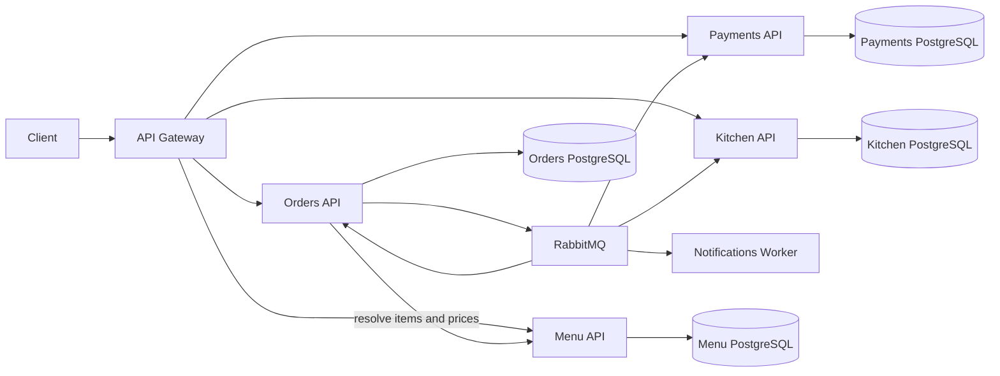

# RestaurantFlow

RestaurantFlow is a cloud-native restaurant ordering platform built with .NET 10. It demonstrates service boundaries, database-per-service ownership, reliable event-driven workflows, resilient HTTP communication, container orchestration, observability, and automated delivery.

The system models an order from menu selection through payment authorization, kitchen preparation, and customer notification.

## Architecture



See [System architecture](docs/architecture.md) and the [architecture decision records](docs/decisions) for the design rationale.

## Services

| Component | Responsibility | Storage |
| --- | --- | --- |
| API Gateway | Public entry point and YARP route forwarding | None |
| Menu API | Products, categories, server-owned prices, and availability | PostgreSQL |
| Orders API | Order lifecycle, price resolution, and workflow state | PostgreSQL + transactional outbox |
| Payments API | Idempotent payment authorization simulation | PostgreSQL |
| Kitchen API | Preparation tickets and kitchen status | PostgreSQL |
| Notifications Worker | Independent customer-event processing | None |

## Technology

- .NET 10, ASP.NET Core Minimal APIs, and Worker Services
- Entity Framework Core and PostgreSQL
- RabbitMQ and MassTransit
- YARP API Gateway
- OpenTelemetry traces and metrics with OTLP export
- Docker Compose
- Kubernetes and Helm
- xUnit architecture and unit tests
- GitHub Actions continuous integration

## Order workflow

1. The client submits menu item identifiers and quantities to the Orders API.
2. Orders resolves the current name, price, and availability from the Menu API.
3. Orders calculates the total, persists the aggregate, and publishes `OrderSubmitted` through its transactional outbox.
4. Payments authorizes or declines the transaction and publishes the result.
5. An approved payment creates a Kitchen ticket.
6. Kitchen events advance the order through preparation and ready states.
7. Notifications consumes customer-relevant events independently.

Clients never provide trusted product names or prices. The Orders-to-Menu call is protected by timeout, retry, and circuit-breaker policies.

## Run locally

Requirements: Docker Desktop with Docker Compose.

```bash
docker compose up --build -d
```

Docker Compose runs a dedicated one-shot migration container for each database before starting its API. Application replicas do not modify schemas during startup.

Available endpoints:

| Resource | Address |
| --- | --- |
| API Gateway | `http://localhost:8080` |
| RabbitMQ Management | `http://localhost:15672` |
| RabbitMQ local credentials | `restaurantflow` / `restaurantflow` |

Run the requests in [docs/demo.http](docs/demo.http) in order to create a menu item, submit approved and declined orders, inspect order state, and list kitchen tickets.

Stop the environment without deleting database volumes:

```bash
docker compose down
```

## Validation

```bash
dotnet test RestaurantFlow.slnx --configuration Release
docker compose config --quiet
helm lint deploy/helm/restaurantflow
helm template restaurantflow deploy/helm/restaurantflow --namespace restaurantflow
```

The GitHub Actions pipeline restores, builds, tests, validates Docker Compose, lints the Helm chart, and renders the Kubernetes manifests for every pull request.

## Reliability and scalability

- Database-per-service ownership prevents cross-service persistence coupling.
- The Orders service uses the MassTransit Entity Framework transactional outbox.
- Consumers use service-prefixed queues, retry policies, and idempotent business keys.
- Server-authoritative menu resolution prevents client-side price manipulation.
- Standard HTTP resilience policies protect synchronous service calls.
- Explicit migration workloads avoid concurrent schema changes across replicas.
- OpenTelemetry instruments ASP.NET Core, HTTP clients, runtime metrics, and MassTransit flows.
- Kubernetes workloads include rolling updates, probes, resource limits, restrictive security contexts, network policies, persistent volumes, and horizontal autoscaling.

## Kubernetes

The Helm chart is documented in [deploy/README.md](deploy/README.md). It deploys application services, isolated PostgreSQL instances, RabbitMQ, migration Jobs, Services, network policies, and autoscaling resources.

## Current status

| Capability | Status |
| --- | --- |
| End-to-end order workflow | Implemented |
| Server-authoritative pricing | Implemented |
| Orders transactional outbox | Implemented |
| Retry and circuit breaker for Menu calls | Implemented |
| Dedicated migration workloads | Implemented |
| Docker Compose and Helm deployment | Implemented |
| Automated unit and architecture tests | Implemented |
| Authentication and policy authorization | Planned |
| Full consumer inbox and idempotency coverage | Planned |
| Saga orchestration and compensation | Planned |
| Local observability dashboard stack | Planned |
| Testcontainers integration test suite | Planned |
| Production secret provider and managed cloud databases | Planned |

## Next milestones

1. Add JWT/OIDC authentication and policy-based authorization.
2. Add PostgreSQL and RabbitMQ integration tests with Testcontainers.
3. Extend transactional outbox and inbox guarantees to every event-producing service.
4. Model the distributed order workflow as a persisted saga with compensation.
5. Add an OpenTelemetry Collector, Prometheus, Grafana, Tempo, and structured log aggregation.
6. Add production overlays for managed Kubernetes, databases, messaging, and secret storage.
