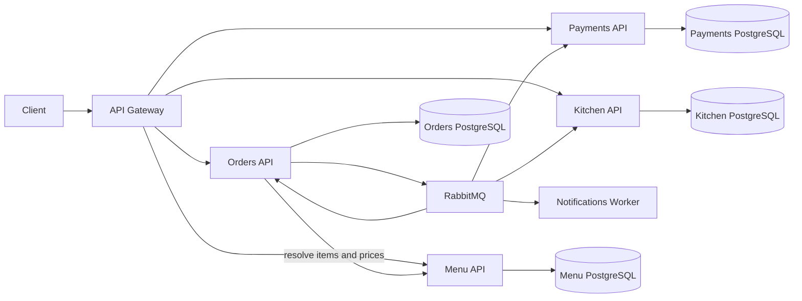

# RestaurantFlow

RestaurantFlow is a cloud-native restaurant ordering platform built with .NET 10. It demonstrates service boundaries, database-per-service ownership, reliable event-driven workflows, resilient HTTP communication, container orchestration, observability, and automated delivery.

The system models an order from menu selection through payment authorization, kitchen preparation, and customer notification.

## Architecture



See [System architecture](docs/architecture.md) and the [architecture decision records](docs/decisions) for the design rationale.

## Services

| Component | Responsibility | Storage |
| --- | --- | --- |
| API Gateway | Public entry point and YARP route forwarding | None |
| Menu API | Products, categories, server-owned prices, and availability | PostgreSQL |
| Orders API | Order lifecycle, price resolution, and workflow state | PostgreSQL + transactional outbox |
| Payments API | Idempotent payment authorization simulation | PostgreSQL |
| Kitchen API | Preparation tickets and kitchen status | PostgreSQL |
| Notifications Worker | Independent customer-event processing | None |

## Technology

- .NET 10, ASP.NET Core Minimal APIs, and Worker Services
- Entity Framework Core and PostgreSQL
- RabbitMQ and MassTransit
- YARP API Gateway and Keycloak OIDC authentication
- OpenTelemetry traces, metrics, and logs with OTLP export
- Prometheus, Grafana, Tempo, and Loki
- Docker Compose
- Kubernetes and Helm
- xUnit unit, architecture, and Testcontainers integration tests
- GitHub Actions continuous integration

## Order workflow

1. The client submits menu item identifiers and quantities to the Orders API.
2. Orders resolves the current name, price, and availability from the Menu API.
3. Orders calculates the total, persists the aggregate, and publishes `OrderSubmitted` through its transactional outbox.
4. A persisted Orders saga sends `AuthorizePayment` and records the workflow state.
5. Payments authorizes or declines the transaction through its transactional Inbox/Outbox.
6. An approved payment makes the saga send `CreateKitchenTicket`; a decline sends the compensating `CancelOrder` command.
7. Kitchen uses its transactional Inbox/Outbox and publishes preparation events.
8. Notifications consumes customer-relevant events independently.

Clients never provide trusted product names or prices. The Orders-to-Menu call is protected by timeout, retry, and circuit-breaker policies.

## Run locally

Requirements: Docker Desktop with Docker Compose.

```bash
docker compose up --build -d
```

Docker Compose runs a dedicated one-shot migration container for each database before starting its API. Application replicas do not modify schemas during startup.

Available endpoints:

| Resource | Address |
| --- | --- |
| API Gateway | `http://localhost:8080` |
| RabbitMQ Management | `http://localhost:15672` |
| RabbitMQ local credentials | `restaurantflow` / `restaurantflow` |
| Local OIDC token endpoint | `http://localhost:8081/realms/restaurantflow/protocol/openid-connect/token` |
| Grafana | `http://localhost:3000` (`admin` / `admin`) |
| Prometheus | `http://localhost:9090` |
| Tempo | `http://localhost:3200` |
| Loki | `http://localhost:3100` |

Run the requests in [docs/demo.http](docs/demo.http) in order to obtain role-specific tokens, create a menu item, submit approved and declined orders, inspect order state, and list kitchen tickets. See [Security model](docs/security.md) and [Observability](docs/observability.md).

Stop the environment without deleting database volumes:

```bash
docker compose down
```

## Validation

```bash
dotnet test RestaurantFlow.slnx --configuration Release
docker compose config --quiet
helm lint deploy/helm/restaurantflow
helm template restaurantflow deploy/helm/restaurantflow --namespace restaurantflow
```

The GitHub Actions pipeline restores, builds, runs unit, architecture, and container-backed integration tests, validates Docker Compose, lints the Helm chart, and renders the Kubernetes manifests for every pull request. See [Testing strategy](docs/testing.md).

## Reliability and scalability

- Database-per-service ownership prevents cross-service persistence coupling.
- Orders, Payments, and Kitchen use MassTransit Entity Framework transactional Inbox/Outbox persistence.
- A PostgreSQL-backed MassTransit saga orchestrates payment, kitchen creation, and cancellation compensation.
- Consumers use service-prefixed queues, retry policies, and idempotent business keys.
- Server-authoritative menu resolution prevents client-side price manipulation.
- Standard HTTP resilience policies protect synchronous service calls.
- Explicit migration workloads avoid concurrent schema changes across replicas.
- OpenTelemetry instruments ASP.NET Core, HTTP clients, runtime metrics, and MassTransit flows.
- Kubernetes workloads include rolling updates, probes, resource limits, restrictive security contexts, granular network policies, topology spreading, disruption budgets, and horizontal autoscaling.

## Kubernetes

The Helm chart is documented in [deploy/README.md](deploy/README.md). It provides self-contained development infrastructure and a production profile for managed PostgreSQL, managed RabbitMQ, External Secrets, TLS Ingress, migration Jobs, availability controls, network policies, and autoscaling.

## Current status

| Capability | Status |
| --- | --- |
| End-to-end order workflow | Implemented |
| Server-authoritative pricing | Implemented |
| Transactional Inbox/Outbox for Orders, Payments, and Kitchen | Implemented |
| Persisted order workflow saga and decline compensation | Implemented |
| Retry and circuit breaker for Menu calls | Implemented |
| Dedicated migration workloads | Implemented |
| Docker Compose and Helm deployment | Implemented |
| Automated unit and architecture tests | Implemented |
| PostgreSQL Testcontainers integration tests | Implemented for Menu pricing |
| OIDC authentication and policy authorization | Implemented |
| OAuth client credentials for Orders to Menu | Implemented |
| Full consumer idempotency coverage | Implemented for core workflow |
| Local observability dashboard stack | Implemented |
| RabbitMQ and full workflow integration tests | Implemented in Docker Compose CI |
| Production secret provider and managed cloud services profile | Implemented |

## Next milestones

1. Add timeout and failure-injection tests for saga recovery paths.
