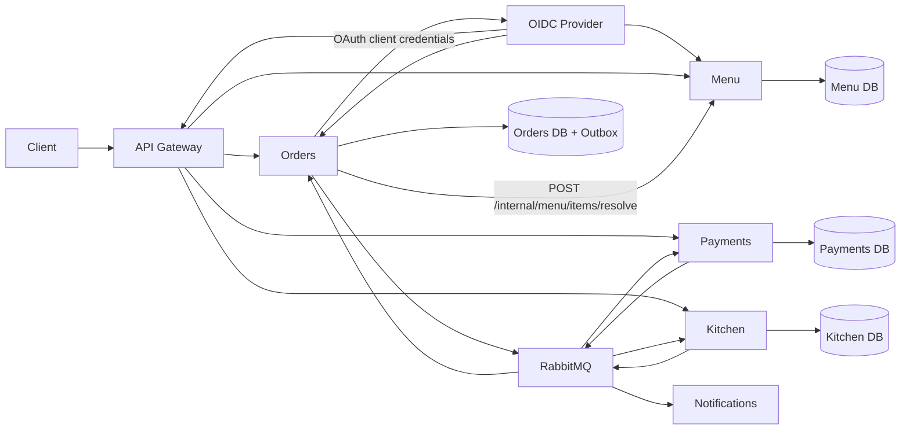
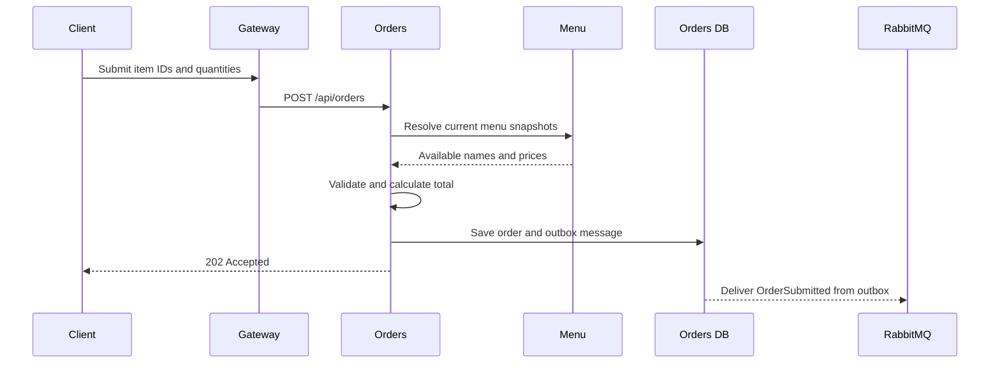

# System architecture

RestaurantFlow uses independently deployable services aligned with restaurant business capabilities. HTTP handles client operations and the price lookup that requires current Menu data. RabbitMQ carries completed business facts so downstream services can work independently.

## Service boundaries

- **Menu** owns product descriptions, categories, availability, and prices.
- **Orders** owns the order aggregate and its lifecycle. It stores an immutable name and price snapshot for every accepted line item.
- **Payments** owns payment attempts and authorization outcomes.
- **Kitchen** owns preparation tickets and kitchen progress.
- **Notifications** reacts to customer-facing events without blocking the main workflow.
- **Gateway** exposes public routes. Internal Menu resolution is not routed publicly.

No service reads another service's database.

## Identity and access

An OIDC provider issues audience-restricted JWT access tokens. Gateway routes and API endpoints enforce the same named role policies. Orders derives customer ownership from `sub` and `email` claims and uses its own client-credentials identity for the private Menu lookup. See [Security model](security.md).

## Order submission

The client cannot choose product names or prices. Missing or unavailable items cause validation failure. Duplicate items and non-positive quantities are rejected before persistence.

The Menu HTTP client uses standard resilience policies for transient failures: total request timeout, retries, attempt timeout, and circuit breaking. If Menu is unavailable, Orders does not accept an order with unverifiable commercial data.

## Asynchronous workflow

1. `OrderSubmitted` creates the persisted workflow saga.
2. The saga publishes `AuthorizePayment`.
3. Payments publishes `PaymentAuthorized` or `PaymentDeclined` through its transactional outbox.
4. Authorization makes the saga publish `CreateKitchenTicket`; a decline publishes the compensating `CancelOrder` command.
5. Kitchen publishes preparation and ready events through its transactional outbox.
6. Orders updates its aggregate while the saga records the distributed workflow state.
7. Notifications consumes customer-relevant events independently.

Delivery is at least once. Core consumers use the MassTransit Entity Framework Inbox, unique business keys, retries, and idempotent state transitions. Orders, Payments, and Kitchen store outgoing messages in the same PostgreSQL transaction as business changes. The saga uses pessimistic PostgreSQL concurrency and keeps final workflow records for diagnostics.

## Persistence and migrations

Each stateful service owns an isolated PostgreSQL database and its Entity Framework Core migrations. API processes do not migrate schemas by default.

- Docker Compose starts one migration container per database and waits for successful completion before starting the corresponding API.
- Helm renders one versioned Kubernetes Job per database for each release revision.
- Migration processes enable `Database__Migrate=true` and `Database__MigrationsOnly=true`, apply pending migrations, and exit.

This prevents horizontally scaled API replicas from racing to modify the same schema during startup.

## Deployment and scaling

Docker Compose provides a reproducible local environment. The Helm chart provides rolling deployments, health probes, resource requests and limits, restrictive security contexts, network policies, persistent storage, and horizontal pod autoscaling for selected workloads.

The default in-cluster PostgreSQL and RabbitMQ resources are demonstration infrastructure. The production Helm profile disables them, consumes managed-service connections from External Secrets, enables TLS Ingress, requires immutable image references, removes automatic workload API tokens, spreads replicas across failure domains, and protects replicas with disruption budgets. Backup policies and tested disaster recovery remain environment responsibilities.

## Observability

The shared observability building block instruments ASP.NET Core, outbound HTTP, runtime metrics, MassTransit operations, and structured logs with OpenTelemetry. Services export OTLP to a central Collector, which routes metrics to Prometheus, traces to Tempo, and logs to Loki. Grafana provisions all three data sources and a service dashboard with trace-to-log correlation. See [Observability](observability.md).
