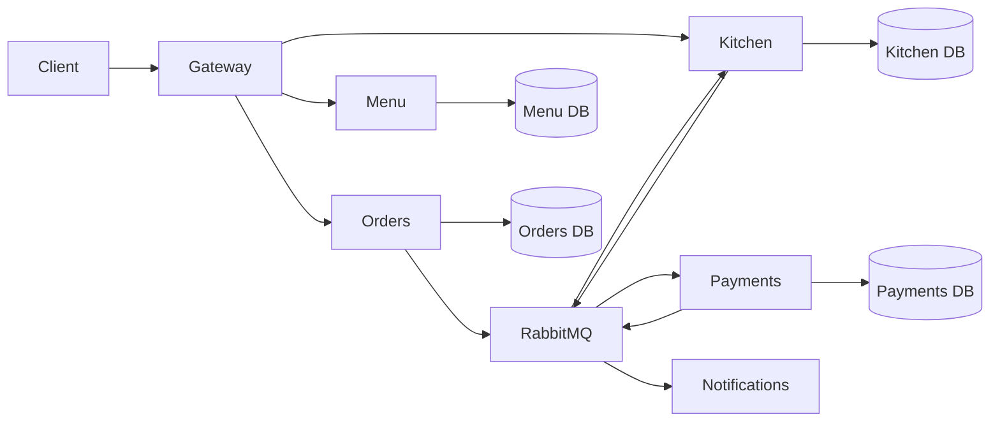

# System architecture

RestaurantFlow uses independently deployable services around restaurant business capabilities. HTTP is reserved for client-facing queries and commands that require an immediate response. RabbitMQ carries facts that have already happened and allows downstream services to process them independently.

## Order workflow

1. Orders validates and accepts a customer's order.
2. `OrderSubmitted` starts the distributed workflow.
3. Payments authorizes the charge and publishes its result.
4. Kitchen creates a preparation ticket after payment approval.
5. Kitchen status events update the order projection.
6. Notifications consumes customer-relevant events independently.

Messages can be delivered more than once. Consumers therefore use message identifiers and business keys to make processing idempotent. Database writes and event publication use the transactional outbox where losing an event would leave the workflow inconsistent.

## Data ownership

Services never query another service's database. A service obtains remote information through an API when freshness is required, or maintains a local projection from integration events when availability and throughput are more important.

