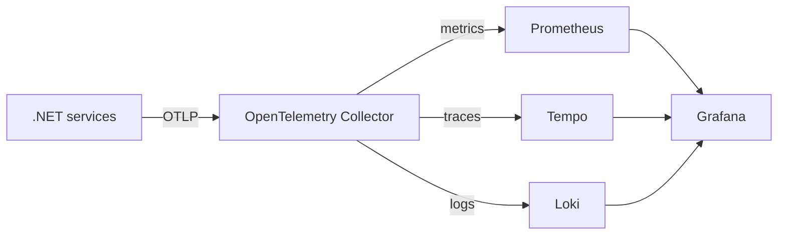

# Observability

RestaurantFlow exports traces, metrics, and structured logs with OpenTelemetry. The local platform provides one place to follow a request from the gateway through synchronous HTTP calls and asynchronous MassTransit consumers.

## Local platform

| Component | Purpose | Address |
| --- | --- | --- |
| OpenTelemetry Collector | Receives OTLP and routes each signal | `http://localhost:13133` |
| Prometheus | Stores and queries metrics | `http://localhost:9090` |
| Tempo | Stores and searches distributed traces | `http://localhost:3200` |
| Loki | Stores and queries structured application logs | `http://localhost:3100` |
| Grafana | Correlated dashboards and exploration | `http://localhost:3000` |

Grafana uses `admin` / `admin` in the local environment. Its data sources and the **RestaurantFlow / Service Overview** dashboard are provisioned automatically.

## Signal flow



Resource attributes include `service.name`, `service.instance.id`, and `deployment.environment.name`. Trace context is propagated over HTTP and MassTransit, allowing Grafana to move from a log entry to its trace and from a trace to related logs.

## Validation

Start the complete environment and execute `docs/demo.http`. Then open Grafana and use the provisioned dashboard or Explore views. The backend readiness endpoints can also be checked directly:

```bash
curl --fail http://localhost:13133/
curl --fail http://localhost:9090/-/ready
curl --fail http://localhost:3200/ready
curl --fail http://localhost:3100/ready
curl --fail http://localhost:3000/api/health
```

The Compose stack is intended for local development. Production telemetry should use authenticated endpoints, encrypted transport, durable object storage, retention policies, alert routing, and separately managed credentials.
