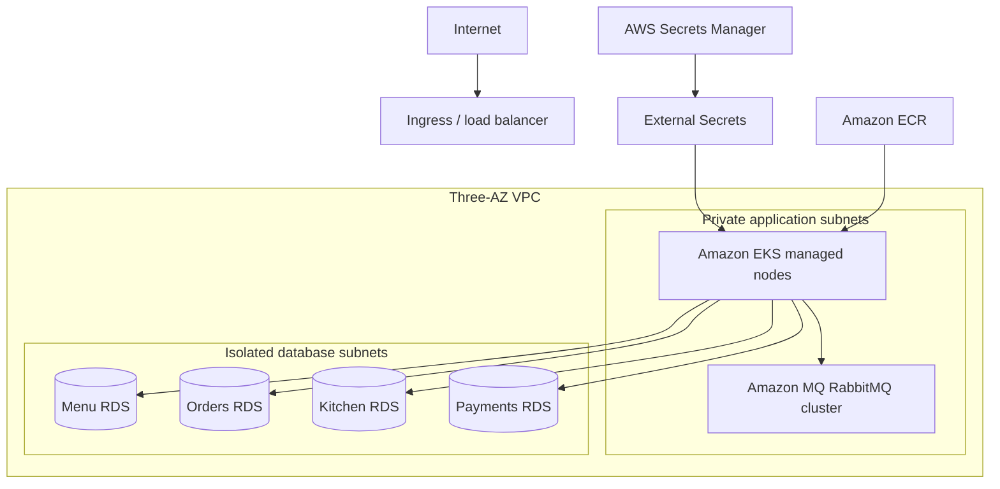

# AWS reference infrastructure

This Terraform stack provisions a production-oriented AWS foundation for RestaurantFlow:

- a three-AZ VPC with public, private application, and isolated database subnets
- an Amazon EKS cluster with a horizontally scalable managed node group
- one encrypted Amazon RDS for PostgreSQL instance per stateful service
- a private, clustered Amazon MQ for RabbitMQ broker
- immutable, KMS-encrypted Amazon ECR repositories with lifecycle policies
- one encrypted AWS Secrets Manager document matching the production Helm contract
- a least-privilege IAM policy for the External Secrets controller

The stack is deliberately a reference deployment. Applying its production defaults creates billable resources, including NAT gateways, EKS, four Multi-AZ databases, and a three-node RabbitMQ broker.

## Architecture



Security groups only allow EKS nodes to reach PostgreSQL over TCP 5432 and RabbitMQ over TLS on TCP 5671. Databases and the broker have no public endpoint. KMS customer-managed keys encrypt databases, snapshots, broker storage, repositories, and runtime secrets.

## Prerequisites

- Terraform 1.10 or later
- AWS CLI authenticated to the target account
- an encrypted remote state bucket with versioning enabled
- an external OIDC provider and confidential Orders client

Terraform state contains generated credentials because it creates database and broker users. Store state only in a tightly controlled, encrypted remote backend and never commit local state.

## Configure and plan

Copy the examples and replace the backend values:

```bash
cp infra/aws/backend.tf.example infra/aws/backend.tf
cp infra/aws/terraform.tfvars.example infra/aws/terraform.tfvars
export TF_VAR_orders_client_secret='<value-from-your-password-manager>'
terraform -chdir=infra/aws init
terraform -chdir=infra/aws plan -out=restaurantflow.tfplan
```

Review cost, Region availability, engine versions, network ranges, deletion protection, backup policy, and capacity before applying. The example uses one NAT gateway for a lower-cost review environment; production should set `single_nat_gateway = false` for per-AZ egress resilience.

Apply only after the plan is approved:

```bash
terraform -chdir=infra/aws apply restaurantflow.tfplan
aws eks update-kubeconfig \
  --region "$(terraform -chdir=infra/aws output -raw aws_region 2>/dev/null || echo us-east-1)" \
  --name "$(terraform -chdir=infra/aws output -raw cluster_name)"
```

## Connect Kubernetes secrets

Install the External Secrets Operator and create an AWS `ClusterSecretStore` named `production-secrets`. Bind the IAM policy returned by `external_secrets_policy_arn` to the controller through EKS Pod Identity or IRSA. The Terraform-managed secret name is `restaurantflow/production`, matching `values-production.yaml`.

The JSON secret contains:

- `rabbitmq-username` and `rabbitmq-password`
- `orders-client-secret`
- `menu-connection`, `orders-connection`, `kitchen-connection`, and `payments-connection`

Deploy an immutable release with the Terraform outputs:

```bash
helm upgrade --install restaurantflow deploy/helm/restaurantflow \
  --namespace restaurantflow \
  --create-namespace \
  --values deploy/helm/restaurantflow/values-production.yaml \
  --set image.repositoryPrefix="$(terraform -chdir=infra/aws output -raw helm_repository_prefix)" \
  --set image.tag="sha-<git-commit>" \
  --set rabbitmq.host="$(terraform -chdir=infra/aws output -raw rabbitmq_host)"
```

Ingress controller, certificate automation, DNS, the External Secrets Operator, and the OIDC provider are platform-level dependencies and intentionally remain outside this application stack.

## Validate without AWS credentials

```bash
terraform -chdir=infra/aws init -backend=false
terraform -chdir=infra/aws fmt -check -recursive
terraform -chdir=infra/aws validate
```

CI runs the same static checks for every pull request.

